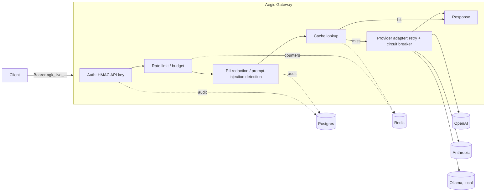

# Aegis Gateway

A multi-tenant gateway that sits in front of LLM providers (OpenAI, Anthropic, local
Ollama models) and exposes an OpenAI-compatible API surface: authentication, rate
limiting, prompt-injection and PII filtering, caching, cost accounting, and audit
logging. Same category as Portkey, LiteLLM proxy, or Cloudflare AI Gateway.

Status: Phase 7 of 9. Tenants, API keys, Postgres RLS, and auth are in;
`/v1/chat/completions` proxies to OpenAI and Ollama with streaming, retries, a
circuit breaker per provider, and idempotency keys; every request is gated by
per-tenant RPM/TPM token buckets, a monthly budget guardrail, and a concurrency cap;
message content runs through Presidio-based PII redaction and heuristic +
embedding-similarity prompt-injection detection before reaching a provider, with
every redaction, block, and auth failure written to a synchronous audit log;
identical requests are served from an exact-match Redis cache instead of hitting the
provider twice; every completed request writes an exact usage/cost record, rolled up
hourly and daily by an arq worker that also scans for tenants crossing their budget;
and the whole pipeline is now instrumented with Prometheus metrics (Grafana
dashboard included) and hand-placed OpenTelemetry spans. Admin API and full docs are
next.

## Architecture



## Stack

Python 3.12, FastAPI (async), Postgres 16 + pgvector, Redis, SQLAlchemy 2.0 (async),
Alembic, arq for background jobs, Presidio for PII detection, Prometheus/OpenTelemetry
for observability.

API keys are HMAC-SHA256 with a server-side pepper (indexable, no bcrypt-on-every-request
cost); admin passwords use argon2id. Postgres RLS enforces tenant isolation at the row
level, on top of the normal application-side `WHERE tenant_id = ...` filtering — the app
connects as a non-superuser role so the policies actually apply.

Every tenant has per-request limits — `rate_limit_rpm`, `rate_limit_tpm`,
`monthly_budget_usd`, `max_concurrent_requests` — enforced atomically in Redis via Lua
scripts (a plain get-then-set is a race under concurrent requests) before a request
reaches the provider. No admin API to change them yet (Phase 8); for now, set them on
the `tenants` row directly.

Message content is redacted for PII (Presidio: spaCy NER + built-in regex recognizers)
before it reaches a provider, unless a tenant has `pii_redaction_enabled=false`. Prompt-
injection detection runs regex heuristics plus, when `OPENAI_API_KEY` is set, cosine
similarity against a small embedded jailbreak corpus — best-effort defense-in-depth, not
a robust guarantee; it degrades to heuristic-only (logged once, not per request) with no
API key configured. Each tenant picks `injection_detection_mode`: `block` (403) or `log`
(allowed through, recorded). Every redaction, injection verdict, and auth failure writes
a synchronous row to `audit_log` — never queued, and never containing raw prompt/PII
content, only categories and scores.

Identical requests (same tenant, model, messages, and generation params — hashed after
redaction, so it's caching what actually gets sent) are served from Redis instead of
hitting the provider again, TTL-bound and skippable per tenant via `cache_enabled`. This
is exact-match only: a repeated non-deterministic request (temperature > 0) replays the
same cached answer rather than generating a fresh one, which is the expected tradeoff of
exact-match caching, not a bug. Semantic (embedding-similarity) caching is a documented
roadmap item, not built — see below.

Every completed request (streaming or not, cache hit or not) writes one `usage_records`
row with exact prompt/completion tokens and cost — separate prompt/completion pricing
per model, not a blended rate, since real providers price them differently. This is the
durable, exact number; the Redis budget guardrail above is a fast, approximate,
pre-flight-only estimate, never reconciled against it. A separate `worker` process (`arq`,
chosen over Celery — see `docs/adr/0002-*`) aggregates `usage_records` into hourly/daily
`usage_rollups` and scans month-to-date spend every 15 minutes, writing one
`budget.threshold_reached` audit event (deduped via a Redis marker) the first time a
tenant crosses 80% or 100% of budget.

`/metrics` exposes Prometheus counters/histograms/gauges for the whole pipeline —
request rate and latency, cache hit ratio, rate/budget/concurrency rejections by
reason, PII/injection detection counts, provider call latency, circuit breaker state,
and cost/token totals. Deliberately no `tenant_id` (or any other unbounded value) on
any label — a label that grows with the tenant count turns every metric into a slow
memory leak; per-tenant breakdown lives in Postgres (`usage_records`/`usage_rollups`),
which is built for exactly that. `docker compose up` also starts Prometheus (scraping
the gateway) and Grafana with a dashboard pre-provisioned — see Quickstart.

Requests are also traced with OpenTelemetry: hand-placed spans across
auth → rate_limit → security_pipeline → cache_lookup → provider_call, not full
auto-instrumented distributed tracing (this is a monolith). Spans print to the
console by default; set `OTEL_EXPORTER_OTLP_ENDPOINT` to ship them to a real
backend (Jaeger, Tempo, Honeycomb, ...) instead — deliberately not bundled into
docker-compose the way Prometheus/Grafana are, since a trace backend is a bigger
infra commitment than a metrics scrape target.

## Quickstart

```bash
cp .env.example .env
docker compose up --build
```

Starts Postgres, Redis, the gateway, the background worker, Prometheus, and Grafana.
The gateway container runs `alembic upgrade head` (which also creates the restricted
`aegis_app` runtime role) before starting. Grafana is at `localhost:3000` (anonymous
viewer access, no login) with the "Aegis Gateway" dashboard already provisioned;
Prometheus is at `localhost:9090`.

Bootstrap a tenant, admin user, and API key:

```bash
uv run python scripts/seed.py \
    --tenant-name "Demo Tenant" \
    --admin-email admin@example.com \
    --admin-password "change-me-now"
```

The key is printed once and stored only as an HMAC digest afterward.

```bash
curl -H "Authorization: Bearer agk_live_..." localhost:8000/v1/ping
curl localhost:8000/healthz
```

Proxy a real chat completion (routes to OpenAI for `gpt-*`/`o1`/`o3`/`o4` models,
Ollama otherwise — set `OPENAI_API_KEY` in `.env` or run Ollama locally):

```bash
curl localhost:8000/v1/chat/completions \
  -H "Authorization: Bearer agk_live_..." \
  -H "Content-Type: application/json" \
  -d '{"model": "gpt-4o-mini", "messages": [{"role": "user", "content": "hi"}]}'
```

Add `"stream": true` for SSE, or an `Idempotency-Key` header to make retries of the
same request safe (a duplicate call with the same key replays the cached response
instead of hitting the provider — and re-billing — twice).

## Local development

```bash
uv venv && source .venv/bin/activate
uv pip install -e ".[dev]"
docker compose up -d postgres redis
alembic upgrade head
uvicorn aegis_gateway.main:app --reload
```

Tests: `pytest`. Lint/typecheck: `ruff check . && mypy src`.

## Roadmap

Not implemented yet, on purpose: semantic caching (exact-match caching is the real
feature, pgvector-based similarity is a stretch goal), a trained prompt-injection
classifier (shipping a heuristic + embedding-similarity detector instead), a generic
policy engine (fixed per-tenant toggles instead of a rules DSL), and anything requiring
HA/multi-region, admin SSO, automated key rotation, or GDPR erasure — out of scope for
a single-instance deployment.

## License

MIT — see [LICENSE](LICENSE).
