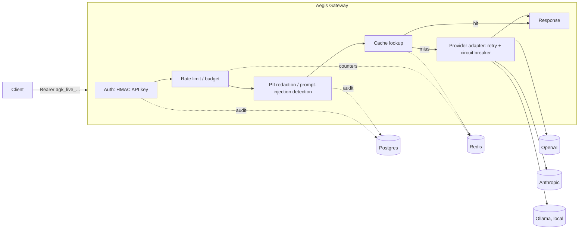

# Aegis Gateway

A multi-tenant gateway that sits in front of LLM providers (OpenAI, Anthropic, local
Ollama models) and exposes an OpenAI-compatible API surface: authentication, rate
limiting, prompt-injection and PII filtering, caching, cost accounting, and audit
logging. Same category as Portkey, LiteLLM proxy, or Cloudflare AI Gateway.

Status: Phase 2 of 9. Tenants, API keys, Postgres RLS, and auth are in, and
`/v1/chat/completions` proxies to OpenAI and Ollama with streaming, retries, a
circuit breaker per provider, and idempotency keys. Rate limiting and the PII/prompt-
injection pipeline are next.

## Architecture



## Stack

Python 3.12, FastAPI (async), Postgres 16 + pgvector, Redis, SQLAlchemy 2.0 (async),
Alembic, arq for background jobs, Presidio for PII detection, Prometheus/OpenTelemetry
for observability.

API keys are HMAC-SHA256 with a server-side pepper (indexable, no bcrypt-on-every-request
cost); admin passwords use argon2id. Postgres RLS enforces tenant isolation at the row
level, on top of the normal application-side `WHERE tenant_id = ...` filtering — the app
connects as a non-superuser role so the policies actually apply.

## Quickstart

```bash
cp .env.example .env
docker compose up --build
```

Starts Postgres, Redis, and the gateway. The gateway container runs `alembic upgrade
head` (which also creates the restricted `aegis_app` runtime role) before starting.

Bootstrap a tenant, admin user, and API key:

```bash
uv run python scripts/seed.py \
    --tenant-name "Demo Tenant" \
    --admin-email admin@example.com \
    --admin-password "change-me-now"
```

The key is printed once and stored only as an HMAC digest afterward.

```bash
curl -H "Authorization: Bearer agk_live_..." localhost:8000/v1/ping
curl localhost:8000/healthz
```

Proxy a real chat completion (routes to OpenAI for `gpt-*`/`o1`/`o3`/`o4` models,
Ollama otherwise — set `OPENAI_API_KEY` in `.env` or run Ollama locally):

```bash
curl localhost:8000/v1/chat/completions \
  -H "Authorization: Bearer agk_live_..." \
  -H "Content-Type: application/json" \
  -d '{"model": "gpt-4o-mini", "messages": [{"role": "user", "content": "hi"}]}'
```

Add `"stream": true` for SSE, or an `Idempotency-Key` header to make retries of the
same request safe (a duplicate call with the same key replays the cached response
instead of hitting the provider — and re-billing — twice).

## Local development

```bash
uv venv && source .venv/bin/activate
uv pip install -e ".[dev]"
docker compose up -d postgres redis
alembic upgrade head
uvicorn aegis_gateway.main:app --reload
```

Tests: `pytest`. Lint/typecheck: `ruff check . && mypy src`.

## Roadmap

Not implemented yet, on purpose: semantic caching (exact-match caching is the real
feature, pgvector-based similarity is a stretch goal), a trained prompt-injection
classifier (shipping a heuristic + embedding-similarity detector instead), a generic
policy engine (fixed per-tenant toggles instead of a rules DSL), and anything requiring
HA/multi-region, admin SSO, automated key rotation, or GDPR erasure — out of scope for
a single-instance deployment.

## License

MIT — see [LICENSE](LICENSE).
